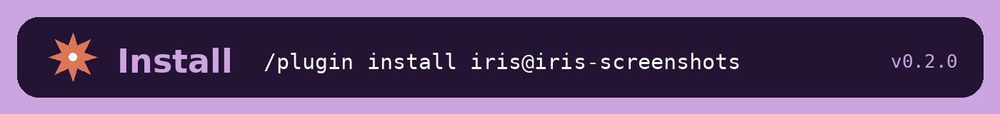
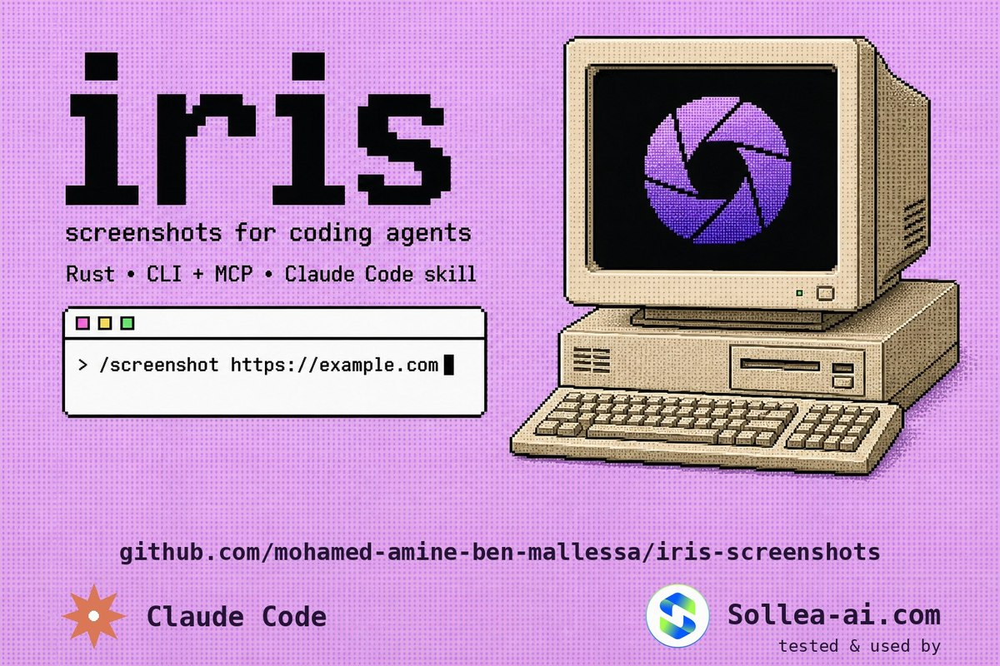
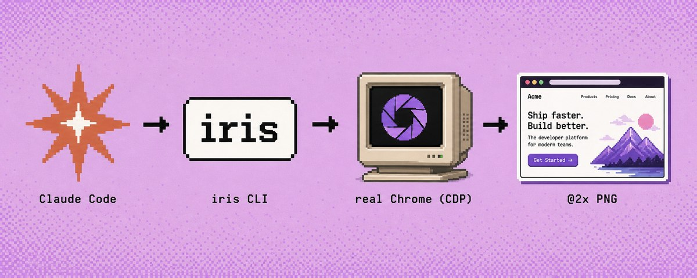
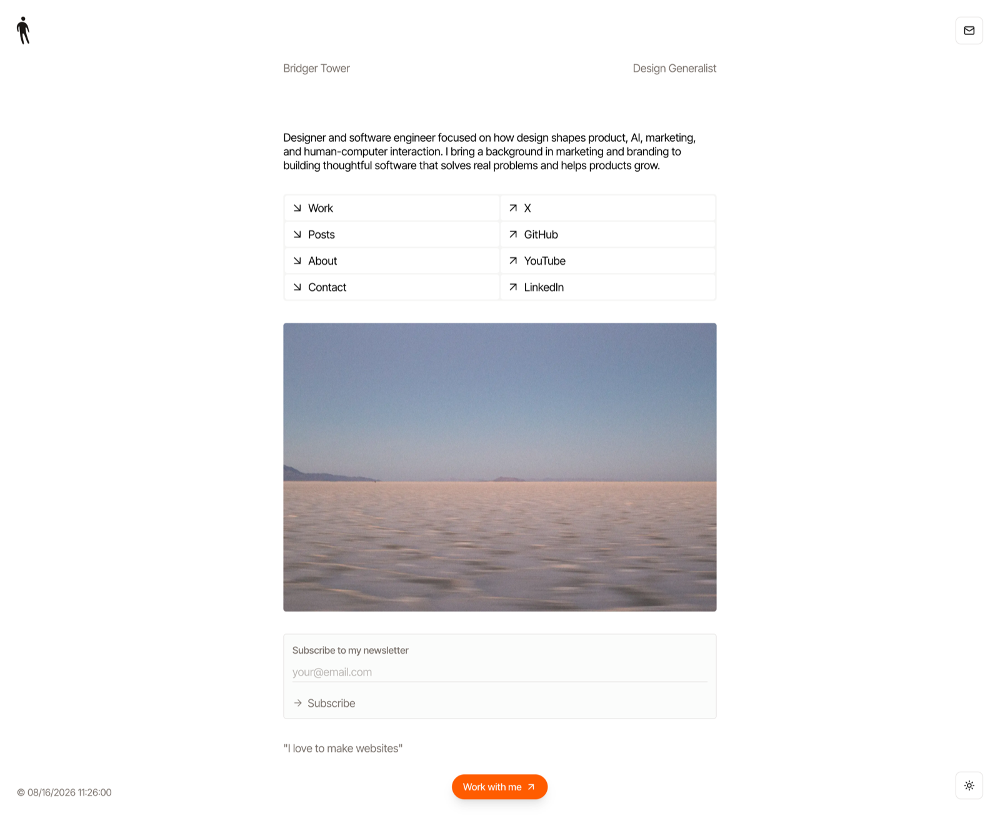

<p align="center">
  
</p>

<p align="center">
  
</p>

# /screenshot — your coding agent just got eyes 👁️

**One command. One trustworthy screenshot.** No Puppeteer scripts, no Playwright
boilerplate, no headless mystery. Just real Chrome, smart waits, and a crisp
@2x PNG — powered by [**iris**](https://github.com/brijr/iris).

> A camera for coding agents. One fast command produces one trustworthy image.

🤝 **Tested and used by [Sollea-ai.com](http://Sollea-ai.com)**

## Why?

Your coding agent can read every line of HTML you ship… and still can't tell
you the hero overlaps the navbar on mobile. **Agents are blind** — they read
source, not pixels.

`/screenshot` fixes that. Claude Code renders the page in a *real* Chrome over
the DevTools Protocol, waits for fonts, images, entrance animations — and
lazy-loaded content on full-page mode — then hands you (or itself) an image it
can actually see.



## Install (30 seconds)

```
/plugin marketplace add mohamed-amine-ben-mallessa/iris-screenshots
/plugin install iris@iris-screenshots
```

Personal use, no marketplace:

```bash
cp -r plugins/iris/skills/screenshot ~/.claude/skills/
```

**First run is self-installing.** The skill runs a preflight (`doctor.sh`) and
fetches `iris` + a Chrome-family browser when missing, then a smoke capture
proves the whole chain works. After that, it just works.

## Try it

```
/screenshot https://example.com
```

Or just talk:

> “screenshot the homepage, full page, dark mode”
> “capture the pricing card, tight framing, 24 px padding”
> “batch-capture these five competitor pages”

## The whole kit (v0.2.1)

| Command | What it does |
|---|---|
| `/screenshot` | Capture any page — full, element, mobile, dark, batch, JSON. |
| `/responsive-audit` | Desktop + iPhone + iPad (+ dark) side by side → severity-graded audit (overflow, overlap, layout, contrast) with fixes. |
| `/visual-diff` | Two states (A/B or before/after) → Added / Removed / Moved / Restyled / Reflow report with an explicit verdict. |
| `@visual-reviewer` | Subagent for proactive visual QA — screenshots what actually rendered after your UI change and reports concrete defects. |
| `capture` (MCP tool) | The bundled MCP camera — pixels returned inline to any MCP client. |

## Commands

| You want | Say it / run it |
|---|---|
| Desktop shot (1440×900 @2x) | `/screenshot https://example.com` |
| Full page height | `iris --full <url>` |
| Full page, dark mode | `iris --full --dark <url>` |
| One element, tight framing | `iris --selector '#pricing-card' --padding 24 <url>` |
| iPhone (390×844 @3x, mobile UA) | `iris -s iphone <url>` |
| iPad (1024×1366 @2x) | `iris -s ipad <url>` |
| Your local dev server | `iris http://localhost:3000` |
| Wait for an element first | `iris --wait-for 'h1' <url>` |
| Concurrent batch | `iris -o shots/ a.com b.com c.com` |
| Machine-readable results | add `--json` (one JSON object per capture) |

Full flag reference →
[`references/flags.md`](plugins/iris/skills/screenshot/references/flags.md)

## It actually sees

`iris --full bridger.to` — a real capture, lazy-load triggered by scrolling,
retina @2x, ~8k px tall:



## Give Claude Code eyes


**The MCP server is bundled — zero setup.** Enabling the plugin registers the
`iris` MCP server (`plugins/iris/.mcp.json`), which exposes one tool,
`capture`, that returns the image **inline** in the tool result — the agent
gets pixels, not a file path to hunt for. The wrapper script is
self-bootstrapping: on a machine without iris, first start installs `iris` +
Chrome for Testing (bootstrap noise goes to a log, the JSON-RPC stream stays
clean). One Chrome process stays warm for the whole session.

Prefer manual? Same thing, by hand:

```json
{ "mcpServers": { "iris": { "command": "iris", "args": ["mcp"] } } }
```

Guided setup + the `capture` tool reference →
[`references/mcp-setup.md`](plugins/iris/skills/screenshot/references/mcp-setup.md)

## What you get

- 🔍 **Real rendering** — your installed Chrome over CDP. Nothing approximated.
- ⏳ **Smart waits** — fonts, images, entrance animations, lazy-load on `--full`.
- 📱 **Presets** — desktop / iPhone / iPad, custom viewports, `--dark`.
- 🎯 **Element mode** — first CSS match, auto-scrolled into view, tightly framed, padded.
- ⚡ **Batch** — concurrent tabs, per-URL JSON, exit code 1 if anything fails.
- 🖥️ **Retina @2x** by default, automatic @1x fallback past Chrome's ~16k px (and it tells you which you got).
- 🧰 **Self-installing** — `doctor.sh` + `install.sh` bundled in the skill.

## Benchmarks

Reference numbers from the iris README (Apple M2 Max, macOS, Chrome 151,
deterministic local page):

| Workload | Result |
|---|---|
| One-shot CLI | 1.00 s median |
| MCP first capture | 965 ms |
| MCP next 10 captures | **366 ms median** · 383 ms p95 |

## Layout

```
iris-screenshots/
├── .claude-plugin/marketplace.json      # marketplace catalog
├── .github/workflows/validate.yml       # CI: strict validate + syntax + frontmatter
├── plugins/iris/
│   ├── .claude-plugin/plugin.json       # plugin manifest (v0.2.1)
│   ├── .mcp.json                        # bundled MCP camera (auto-registered)
│   ├── scripts/iris-mcp.sh              # self-bootstrapping MCP wrapper
│   ├── agents/visual-reviewer.md        # proactive visual QA subagent
│   └── skills/
│       ├── screenshot/                  # /screenshot + references/ + scripts/
│       ├── responsive-audit/            # /responsive-audit
│       └── visual-diff/                 # /visual-diff
└── assets/
```

## Known limitations (honesty section)

- `--selector` = first match in document order only, no multi-match.
- Cross-origin iframe content is invisible.
- A camera, not a driver: no clicks, typing, or scripted scroll.

## Credits

- Engine: [iris](https://github.com/brijr/iris) by [brijr](https://github.com/brijr) (MIT)
- Tested & used by [Sollea-ai.com](http://Sollea-ai.com)
- Built with Claude Code 🤖

## License

MIT. The plugin is MIT; the engine ([iris](https://github.com/brijr/iris)) is
MIT. Go make your agent see. 📸
