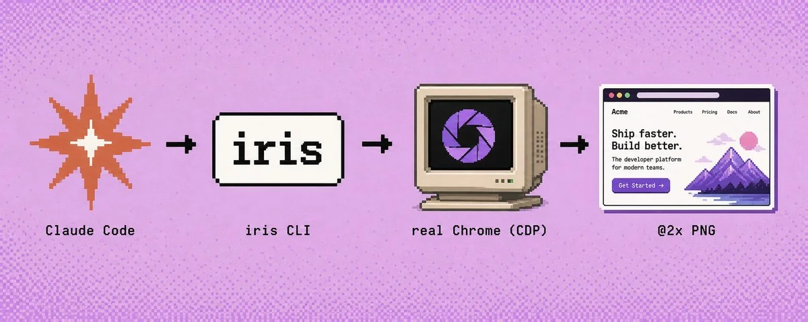
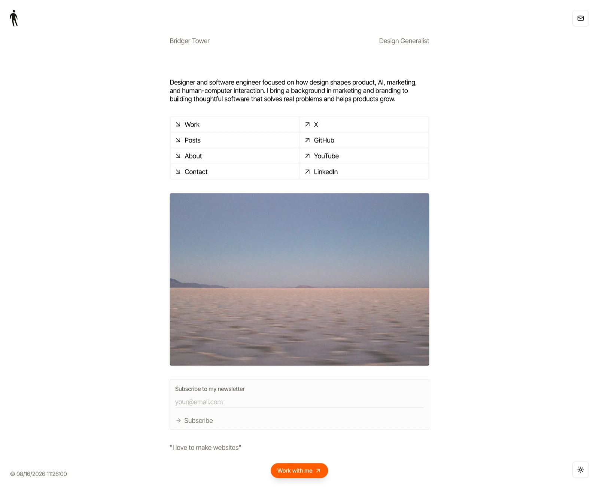
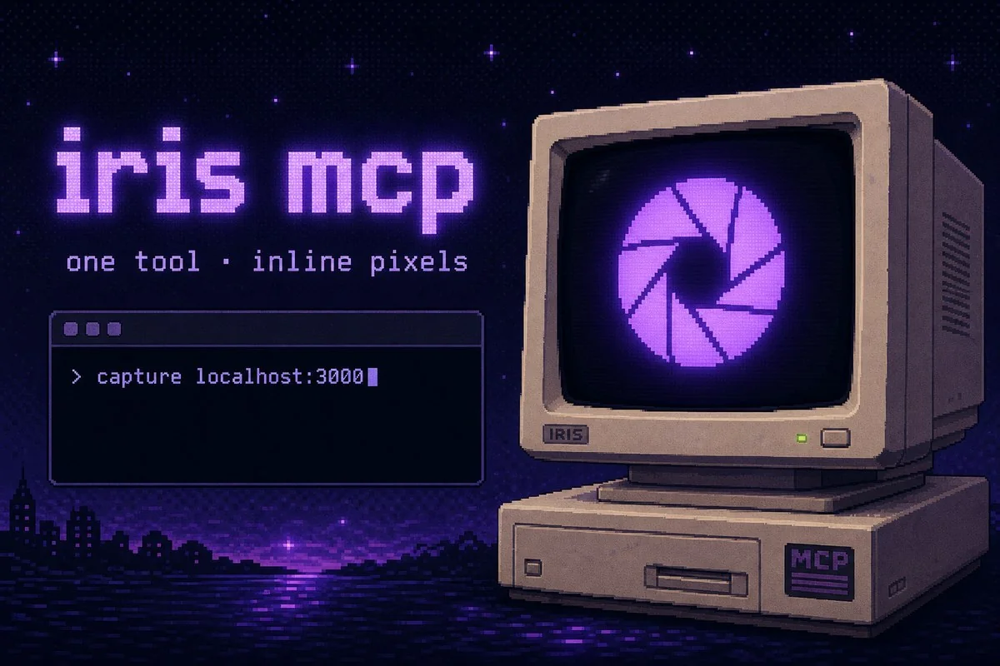

<div align="center">


# 👁️ /screenshot

### Your coding agent just got eyes.

**One command. One trustworthy screenshot.** No Puppeteer scripts, no Playwright
boilerplate, no headless mystery — real Chrome, smart waits, and a crisp @2x PNG.

[](https://github.com/mohamed-amine-ben-mallessa/iris-screenshots/actions/workflows/validate.yml)
[](plugins/iris/.claude-plugin/plugin.json)
[](https://github.com/brijr/iris)
[](LICENSE)
[](https://github.com/mohamed-amine-ben-mallessa/iris-screenshots/stargazers)

[**Install**](#install-in-30-seconds) · [**Try it**](#try-it) · [**The kit**](#the-whole-kit) · [**MCP camera**](#the-mcp-camera-is-bundled) · [**Limits**](#known-limitations)

</div>

```
/plugin marketplace add mohamed-amine-ben-mallessa/iris-screenshots
/plugin install iris@iris-screenshots
```

---

## Agents are blind

Your coding agent can read every line of HTML you ship — and still not tell you
the hero overlaps the navbar on mobile. It reads source. It does not see pixels.

| Without eyes | With `/screenshot` |
|---|---|
| “The CSS looks correct.” | “The hero overlaps the navbar at 390 px — here's the capture.” |
| “The dark theme should work.” | “`.card` has no dark variant: white text on white. Line 42.” |
| “I changed the pricing card.” | “You also pushed the footer 200 px down. Unintended.” |

`/screenshot` renders the page in a **real** Chrome over the DevTools Protocol,
waits for fonts, images, entrance animations — and lazy-loaded content on
full-page mode — then hands your agent an image it can actually see.

<div align="center">

</div>

## Install in 30 seconds

```
/plugin marketplace add mohamed-amine-ben-mallessa/iris-screenshots
/plugin install iris@iris-screenshots
```

<div align="center">

</div>

**First run is self-installing.** The skill runs a preflight (`doctor.sh`) and
fetches `iris` + a Chrome-family browser when missing, then a smoke capture
proves the whole chain works. After that, it just works.

<details>
<summary>Personal use, no marketplace</summary>

```bash
cp -r plugins/iris/skills/screenshot ~/.claude/skills/
```

Or point Claude Code at the plugin directory:

```bash
claude --plugin-dir /path/to/iris-screenshots/plugins/iris
```

</details>

## Try it

```
/screenshot https://example.com
```

Or just talk to it:

> “screenshot the homepage, full page, dark mode”
> “capture the pricing card, tight framing, 24 px padding”
> “batch-capture these five competitor pages”

## The whole kit

| | What it does |
|---|---|
| **`/screenshot`** | Capture any page — full, element, mobile, dark, batch, JSON. |
| **`/responsive-audit`** | Desktop + iPhone + iPad (+ dark) side by side → severity-graded audit (overflow, overlap, layout, contrast) with fixes. |
| **`/visual-diff`** | Two states (A/B or before/after) → Added / Removed / Moved / Restyled / Reflow report with an explicit verdict. |
| **`@visual-reviewer`** | Subagent for proactive visual QA — screenshots what actually rendered after your UI change and reports concrete defects. |
| **`capture`** (MCP) | The bundled MCP camera — pixels returned inline to any MCP client. |

## It actually sees

`iris --full bridger.to` — a real capture, lazy-load triggered by scrolling,
retina @2x, roughly 8 000 px tall. Scaled down to fit this page:

<div align="center">

</div>

## The MCP camera is bundled

<div align="center">

</div>

**Zero setup.** Enabling the plugin registers the `iris` MCP server
([`plugins/iris/.mcp.json`](plugins/iris/.mcp.json)), which exposes one tool,
`capture`, returning the image **inline** in the tool result — your agent gets
pixels, not a file path to hunt for.

The wrapper script is self-bootstrapping: on a machine without iris, first start
installs `iris` + Chrome for Testing (bootstrap noise goes to a log, the JSON-RPC
stream stays clean). One Chrome process stays warm for the whole session.

<details>
<summary>Prefer to wire it by hand?</summary>

```json
{ "mcpServers": { "iris": { "command": "iris", "args": ["mcp"] } } }
```

Guided setup and the full `capture` tool reference →
[`references/mcp-setup.md`](plugins/iris/skills/screenshot/references/mcp-setup.md)

</details>

<div align="center">

</div>

## What you get

- 🔍 **Real rendering** — your installed Chrome over CDP. Nothing approximated.
- ⏳ **Smart waits** — fonts, images, entrance animations, lazy-load on `--full`.
- 📱 **Presets** — desktop / iPhone / iPad, custom viewports, `--dark`.
- 🎯 **Element mode** — first CSS match, auto-scrolled into view, tightly framed, padded.
- ⚡ **Batch** — concurrent tabs, per-URL JSON, exit code 1 if anything fails.
- 🖥️ **Retina @2x** by default, automatic @1x fallback past Chrome's ~16k px limit (and it tells you which you got).
- 🧰 **Self-installing** — `doctor.sh` + `install.sh` bundled in every skill.

<details>
<summary><b>Command reference</b> — every capture mode, one table</summary>

<br>

| You want | Say it / run it |
|---|---|
| Desktop shot (1440×900 @2x) | `/screenshot https://example.com` |
| Full page height | `iris --full <url>` |
| Full page, dark mode | `iris --full --dark <url>` |
| One element, tight framing | `iris --selector '#pricing-card' --padding 24 <url>` |
| iPhone (390×844 @3x, mobile UA) | `iris -s iphone <url>` |
| iPad (1024×1366 @2x) | `iris -s ipad <url>` |
| Your local dev server | `iris http://localhost:3000` |
| Wait for an element first | `iris --wait-for 'h1' <url>` |
| Concurrent batch | `iris -o shots/ a.com b.com c.com` |
| Machine-readable results | add `--json` (one JSON object per capture) |

Full flag reference →
[`references/flags.md`](plugins/iris/skills/screenshot/references/flags.md)

</details>

<details>
<summary><b>Benchmarks</b> — reference numbers from the iris README</summary>

<br>

Apple M2 Max, macOS, Chrome 151, deterministic local page:

| Workload | Result |
|---|---|
| One-shot CLI | 1.00 s median |
| MCP first capture | 965 ms |
| MCP next 10 captures | **366 ms median** · 383 ms p95 |

Not a performance guarantee — capture time includes navigation and correctness
waits, so compare like for like.

</details>

<details>
<summary><b>Repository layout</b></summary>

<br>

```
iris-screenshots/
├── .claude-plugin/marketplace.json      # marketplace catalog
├── .github/workflows/validate.yml       # CI: strict validate, syntax, exec bits, drift
├── plugins/iris/
│   ├── .claude-plugin/plugin.json       # plugin manifest
│   ├── .mcp.json                        # bundled MCP camera (auto-registered)
│   ├── scripts/iris-mcp.sh              # self-bootstrapping MCP wrapper
│   ├── agents/visual-reviewer.md        # proactive visual QA subagent
│   └── skills/
│       ├── screenshot/                  # /screenshot + references/ + scripts/
│       ├── responsive-audit/            # /responsive-audit
│       └── visual-diff/                 # /visual-diff
└── assets/
```

</details>

## Known limitations

An honest list, because a camera that overpromises is worse than no camera:

- `--selector` captures the **first** match in document order only — no multi-match.
- Cross-origin iframe content is invisible.
- It is a camera, not a driver: no clicks, typing, or scripted scroll.
- Running as root (containers, CI), Chrome needs `--no-sandbox`; the scripts
  generate a shim automatically. See
  [`troubleshooting.md`](plugins/iris/skills/screenshot/references/troubleshooting.md).

## Credits

- Engine: [**iris**](https://github.com/brijr/iris) by [brijr](https://github.com/brijr) — MIT. Go star it too.
- Tested and used by [**Sollea-ai.com**](http://Sollea-ai.com)
- Built with Claude Code 🤖

## License

MIT — the plugin and the engine both. Go make your agent see. 📸

<div align="center">
<br>

**If this saved you a round-trip with your agent, [⭐ star the repo](https://github.com/mohamed-amine-ben-mallessa/iris-screenshots) —
it is how other people find it.**

</div>
